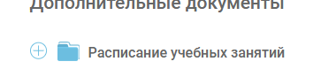
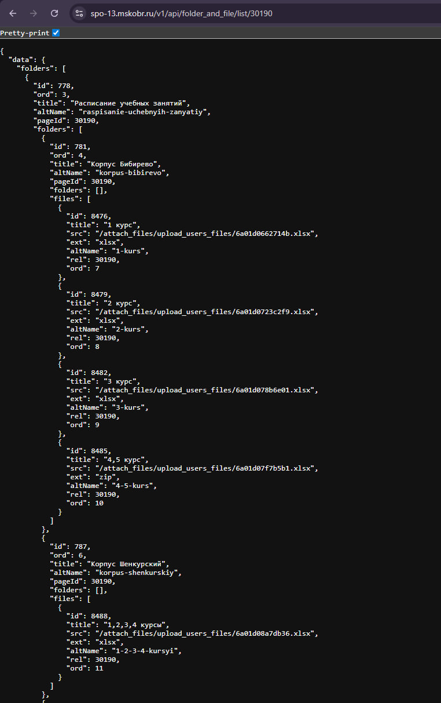
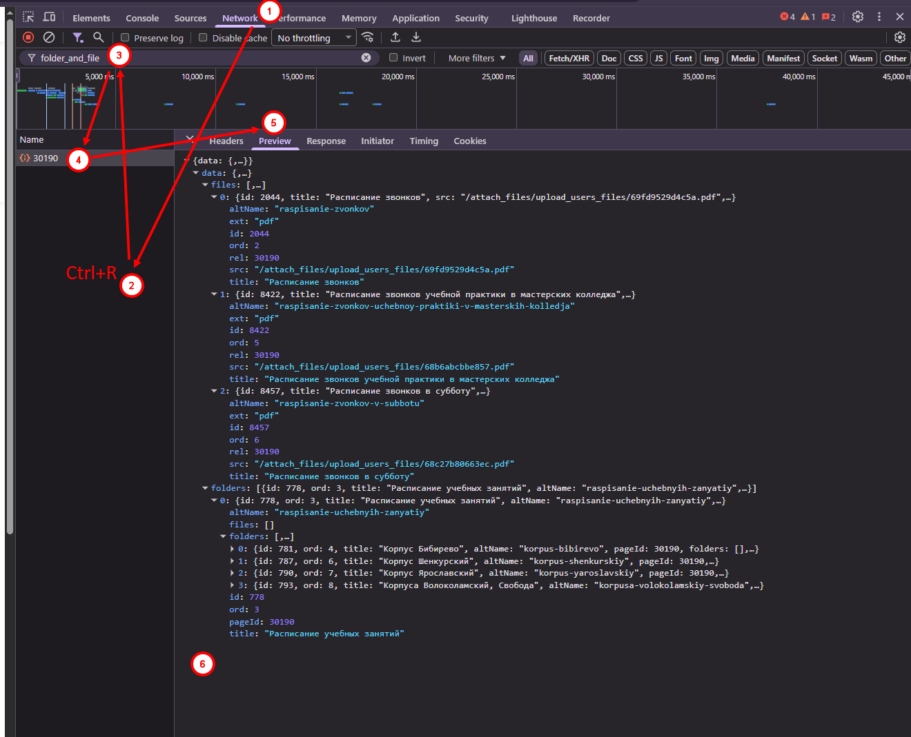

# API-парсер расписания — ГБПОУ ПК им. П.А. Овчинникова

---

## Прогресс — Telegram-бот

<!-- BOT_TABLE_START -->
| Студент | Репозиторий | Структура | 🔒 Безопасность | Этап 1 🚀 | Этап 2 📅 | Этап 3 💾 |
|---------|-------------|-----------|-----------------|-----------|-----------|----------|
| Vlad Boryushin | [UP_06_12-05-2026_Vlad_Boryushin_32ISd](https://github.com/PKO-LP/UP_06_12-05-2026_Vlad_Boryushin_32ISd) | ⏳ Нет bot.py | — | ⏳ | ⏳ | ⏳ |
| Ivan Mikheev | [UP_06_12-05-2026_Ivan_Mikheev_32ISD](https://github.com/PKO-LP/UP_06_12-05-2026_Ivan_Mikheev_32ISD) | ⏳ Нет bot.py | — | ⏳ | ⏳ | ⏳ |
| MINGBOI SADDAM | [UP_06_13-05-2026_MINGBOI_SADDAM_32ISD](https://github.com/PKO-LP/UP_06_13-05-2026_MINGBOI_SADDAM_32ISD) | ✅ Структура OK | 🔑 Токен в bot.py! | ⏳ | ⏳ | ⏳ |
| David Vardanyan | [UP_06_12-05-2026_David_Vardanyan_32ISD](https://github.com/PKO-LP/UP_06_12-05-2026_David_Vardanyan_32ISD) | ⏳ Нет bot.py | — | ⏳ | ⏳ | ⏳ |
| Gizatulin Vitaliy | [UP_06_12-05-2026_Gizatulin_Vitaliy_32ISD](https://github.com/PKO-LP/UP_06_12-05-2026_Gizatulin_Vitaliy_32ISD) | ⏳ Нет bot.py | — | ⏳ | ⏳ | ⏳ |

_Обновлено: 13.05.2026 08:51 UTC_
<!-- BOT_TABLE_END -->

---

## Прогресс — Парсер

<!-- STUDENTS_TABLE_START -->
| Студент | Репозиторий | Статус |
|---------|-------------|--------|
| Vlad Boryushin | [UP_06_12-05-2026_Vlad_Boryushin_32ISd](https://github.com/PKO-LP/UP_06_12-05-2026_Vlad_Boryushin_32ISd) | ✅ Сдано |
| Ivan Mikheev | [UP_06_12-05-2026_Ivan_Mikheev_32ISD](https://github.com/PKO-LP/UP_06_12-05-2026_Ivan_Mikheev_32ISD) | ✅ Сдано |
| MINGBOI SADDAM | [UP_06_13-05-2026_MINGBOI_SADDAM_32ISD](https://github.com/PKO-LP/UP_06_13-05-2026_MINGBOI_SADDAM_32ISD) | ❌ Есть ошибки |
| David Vardanyan | [UP_06_12-05-2026_David_Vardanyan_32ISD](https://github.com/PKO-LP/UP_06_12-05-2026_David_Vardanyan_32ISD) | ✅ Сдано |
| Gizatulin Vitaliy | [UP_06_12-05-2026_Gizatulin_Vitaliy_32ISD](https://github.com/PKO-LP/UP_06_12-05-2026_Gizatulin_Vitaliy_32ISD) | ✅ Сдано |

_Обновлено: 13.05.2026 08:51 UTC_
<!-- STUDENTS_TABLE_END -->

---

## Техническое задание

### Описание

🤖 Разработать Telegram-бота, который выдаёт расписание занятий по группам на всю неделю.

Бот берёт на себя задачу скачивания файлов с сайта колледжа и извлечения данных из них.  
Таким образом, студент получает доступ к расписанию в удобном формате — всего в один клик.  
Просто запустите бота! 🔥

---

### Источник данных

На сайте колледжа есть раздел «Дополнительные документы» с папкой «Расписание учебных занятий»:



Визуально это выглядит как обычная папка на сайте. Но сайт сделан на Vue.js и данные загружает через API — это значит, папки и файлы можно получить напрямую через HTTP-запрос, без парсинга HTML.

По запросу к эндпоинту:

```
GET https://spo-13.mskobr.ru/v1/api/folder_and_file/list/30190
```

сервер возвращает JSON с деревом папок и ссылками на xlsx-файлы расписания по корпусам и курсам:



Каждый файл в JSON содержит поле `src` — относительный путь. Полный URL файла собирается так:

```
"src": "/attach_files/upload_users_files/6a01d0662714b.xlsx"

→  https://spo-13.mskobr.ru  +  /attach_files/upload_users_files/6a01d0662714b.xlsx
=  https://spo-13.mskobr.ru/attach_files/upload_users_files/6a01d0662714b.xlsx
```

Вставь этот URL в браузер — файл скачается напрямую. В коде это одна строка:
```python
url = BASE_URL + f['src']   # BASE_URL = 'https://spo-13.mskobr.ru'
```

Например, для файла «1 курс» из Корпуса Бибирево (видно на скриншоте JSON выше):
```
f['src'] = "/attach_files/upload_users_files/6a01d0662714b.xlsx"

url = "https://spo-13.mskobr.ru" + "/attach_files/upload_users_files/6a01d0662714b.xlsx"
    = "https://spo-13.mskobr.ru/attach_files/upload_users_files/6a01d0662714b.xlsx"
```
👉 Открой этот URL в браузере — браузер скачает xlsx-файл с расписанием.

---

#### Как найти этот API-запрос самостоятельно через DevTools

Так можно увидеть любой запрос, который делает сайт — и использовать его в своём коде.

1. Открой страницу https://spo-13.mskobr.ru/uchashimsya/raspisanie-kanikuly в Chrome
2. Нажми `F12` — откроется DevTools
3. Перейди на вкладку **Network** (Сеть)
4. Нажми `Ctrl+R` — страница перезагрузится и DevTools перехватит все запросы
5. В поле фильтра введи `folder_and_file` — останется один нужный запрос
6. Кликни на него → вкладка **Preview** — увидишь JSON-ответ с деревом папок и файлов



---

В репозитории уже есть заготовка парсера — файл [`parser.py`](parser.py).  
Его нужно **доработать самостоятельно**: в каждом шаге есть два закомментированных варианта — нужно раскомментировать **правильный**. После доработки интегрируй парсер в своего Telegram-бота.

---

### Как назвать своё репозиторий

> ⚠️ Имя репозитория проверяется автоматически. Неверное название = работа не будет проверена.

Шаблон:
```
UP_06_ДД-ММ-ГГГГ_Name_Surname_32ISd
```

Пример:
```
UP_06_12-05-2026_Ivan_Petrov_32ISd
```

Правила:
- `UP_06` — номер учебной практики (не менять)
- `12-05-2026` — дата (не менять)
- `Name_Surname` — твоё имя и фамилия **латиницей**, с заглавной буквы
- `32ISd` — группа (не менять)
- Пробелов нет — только подчёркивания `_`

---

### Автоматическая проверка `parser.py`

После того как ты сдашь (запушишь) `parser.py`, в твоём репозитории **автоматически появится файл `REVIEW.md`** с результатом проверки.

Как это работает:
1. Раз в 2 часа GitHub Actions преподавателя сканирует все репозитории студентов
2. Скачивает твой `parser.py` и анализирует код
3. Коммитит `REVIEW.md` с результатом прямо в твоё репо

Что увидишь в `REVIEW.md`:
- ✅ **Всё верно** → можно двигаться дальше
- ❌ **Ошибка** → указан шаг, что раскомментировано и подсказка как исправить

> Ноутбук преподавателя для этого **не нужен** — всё работает на серверах GitHub 24/7.

---

### Требования к боту

| # | Требование |
|---|-----------|
| 1 | **Inline и Reply кнопки** — использовать оба вида. Логику привязки выбрать самостоятельно |
| 2 | **Кеширование данных** — минимум: локальная БД в виде директорий (`c1/`, `c2/`, `c3/`, `c4/`) |
| 3 | **Проверка обновлений** — если файл на сайте не изменился, бот не скачивает его повторно |
| 4 | **Автообновление расписания** — раз в сутки. Для тестирования можно сократить до 1–5 минут |
| 5 | **Деплой на Vercel** — задеплоить бота с помощью DeepSeek или другой модели |

---

### Готовый шаблон бота (для вдохновения)

За основу можно взять готовый шаблон и внедрить из него понравившийся функционал:  
https://github.com/k1rrrkvz/TelegramBot-Schedule-Parser/tree/main

---

### Деплой бота на Vercel — пошаговая инструкция

> Vercel — это бесплатная платформа для хостинга. Подходит для Python и Telegram-ботов.

**Шаги:**

1. **Зарегистрируйся на** https://vercel.com — через аккаунт GitHub
2. **Подготовь структуру проекта** — в корне репозитория должны быть:
   - `api/webhook.py` — обработчик webhook-запросов от Telegram
   - `vercel.json` — конфиг для Vercel (пример ниже)
   - `requirements.txt` — зависимости (`python-telegram-bot`, `requests` и т.д.)
3. **Создай `vercel.json`** в корне репозитория:
   ```json
   {
     "builds": [{ "src": "api/webhook.py", "use": "@vercel/python" }],
     "routes": [{ "src": "/webhook", "dest": "api/webhook.py" }]
   }
   ```
4. **Задеплой через GitHub**: зайди на vercel.com → New Project → выбери свой репозиторий → Deploy
5. **Укажи Telegram webhook**: после деплоя Vercel выдаст URL вида `https://your-bot.vercel.app`.  
   Отправь запрос:
   ```
   https://api.telegram.org/bot<TOKEN>/setWebhook?url=https://your-bot.vercel.app/webhook
   ```
6. **Готово!** Telegram будет слать все сообщения на твой сервер.

> ⚠️ На бесплатном тарифе Vercel функции засыпают. Для автообновления расписания лучше использовать внешний крон-сервис: https://cron-job.org

---

### Если что-то не работает — промт для DeepSeek

Если при деплое на Vercel возникли ошибки — скопируй текст ниже, вставь на https://chat.deepseek.com, подставив свои данные вместо `[...]`:

---

````
Помоги задеплоить Telegram-бота на Python на Vercel.

Структура проекта:
[вставь сюда вывод команды: tree /f или скриншот файлов]

Содержимое vercel.json:
[вставь содержимое файла vercel.json]

Содержимое requirements.txt:
[вставь содержимое]

Ошибка, которую я получаю:
[вставь текст ошибки из логов Vercel — он виден на вкладке "Deployments" → кликнуть на деплой → вкладка "Build Logs" или "Function Logs"]

Токен бота я уже получил через @BotFather.
Webhook установлен командой: https://api.telegram.org/bot<TOKEN>/setWebhook?url=<МОЙ_URL>/webhook

Что именно нужно исправить? Дай готовый рабочий код.
````

---

> **Совет:** Всегда прикладывай к промту точный текст ошибки из Vercel. DeepSeek не сможет помочь без него.

---

### Что нужно задокументировать (дополнить этот README.md)

- [ ] Описание бота: что это, зачем нужно, как работает
- [ ] Скриншот или блок кода с работающей функцией **автопроверки обновлений**
- [ ] Инструкция по **локальному запуску** бота
- [ ] Скриншот деплоя на Vercel

> Не знаешь как написать README? Используй промт ниже 👇

---

### Шаблон промта для DeepSeek — сгенерировать свой README.md

Скопируй текст ниже, вставь на https://chat.deepseek.com, подставив свои данные вместо `[...]`:

---

````
Напиши README.md для моего учебного проекта — Telegram-бота расписания колледжа.

Меня зовут [Имя Фамилия], группа [32ИСд].

Что умеет мой бот:
[опиши своими словами — например: показывает расписание по курсам, обновляет данные раз в сутки, есть inline и reply кнопки]

Как работает технически:
- Парсит расписание через API сайта колледжа: GET https://spo-13.mskobr.ru/v1/api/folder_and_file/list/30190
- Скачивает xlsx-файлы и кеширует их локально (папки c1/, c2/, c3/, c4/)
- Проверяет обновления по полю src в JSON-ответе — если не изменилось, не скачивает повторно
- Автообновление раз в [N минут/сутки] через [scheduler / asyncio / cron-job.org]

Стек: Python, python-telegram-bot, requests
Деплой: Vercel

Структура проекта:
[вставь вывод команды: tree /f /a  или просто перечисли файлы]

Требования к README:
- Заголовок с названием проекта и именем автора
- Краткое описание (2–3 предложения)
- Скриншот или gif работы бота (напиши placeholder [СКРИНШОТ])
- Раздел «Как запустить локально» с командами
- Раздел «Деплой» — как задеплоить на Vercel (placeholder [СКРИНШОТ ДЕПЛОЯ])
- Раздел «Как работает кеширование» — объяснение логики проверки обновлений
- Бейджи: Python версия, лицензия MIT

Пиши на русском языке. Используй emoji там где уместно.
````

---

### С чего начать — настройка проекта

#### Шаг 1. Сделай форк и назови его правильно

1. Открой исходный репозиторий:  
   👉 https://github.com/PKO-LP/UP_Shedule_Parsing_Bot

2. Нажми кнопку **Fork** (правый верхний угол)

3. В поле **Owner** выбери организацию **PKO-LP**  
   *(не свой личный аккаунт, а именно организацию)*

4. В поле **Repository name** введи название по шаблону:
   ```
   UP_06_12-05-2026_Имя_Фамилия_32ИСд
   ```
   Пример:
   ```
   UP_06_12-05-2026_Ivan_Petrov_32ИСд
   ```

5. Нажми **Create fork**

6. Клонируй свой форк на компьютер:
   ```
   git clone https://github.com/PKO-LP/UP_06_12-05-2026_Имя_Фамилия_32ИСд.git
   ```

> ⚠️ **Важно:** форк должен быть создан именно в организации **PKO-LP**, а не в личном аккаунте. Иначе преподаватель не увидит твою работу.

**Если нет доступа к организации PKO-LP — напиши преподавателю.**

---

#### Шаг 2. Открой проект в PyCharm или VS Code

**PyCharm:**
1. File → Open → выбери папку проекта
2. PyCharm предложит создать виртуальное окружение — нажми **OK** (или Create venv)
3. Внизу справа убедись, что выбран интерпретатор Python 3.10+

**VS Code:**
1. File → Open Folder → выбери папку проекта
2. Установи расширение **Python** (если ещё нет): Extensions → поиск "Python" → Install
3. Нажми `Ctrl+Shift+P` → введи `Python: Select Interpreter` → выбери Python 3.10+

---

#### Шаг 3. Создай виртуальное окружение и установи зависимости

Открой терминал внутри IDE (в PyCharm: внизу вкладка **Terminal**, в VS Code: `Ctrl+` `` ` ``).  
Убедись, что ты находишься в папке проекта — в строке терминала должен быть путь к твоему проекту.

Введи команды **по одной**, нажимая Enter после каждой:

```bash
# 1. Создать виртуальное окружение — папку venv/ с изолированным Python
#    Делается ОДИН РАЗ при создании проекта
python -m venv venv
```

```bash
# 2. Активировать окружение — теперь pip будет ставить пакеты только в этот проект
# Windows:
venv\Scripts\activate
# Mac/Linux:
source venv/bin/activate
```

> После активации в начале строки терминала появится `(venv)` — это значит, всё ок:
> ```
> (venv) C:\Users\...\my-bot>
> ```

```bash
# 3. Установить нужные библиотеки
#    pip — это менеджер пакетов Python, он скачивает библиотеки из интернета (с pypi.org)
#    requests         — для HTTP-запросов (уже используется в parser.py)
#    python-telegram-bot — официальная библиотека для написания Telegram-ботов
pip install requests python-telegram-bot
```

> Библиотеки скачиваются с https://pypi.org — официального реестра Python-пакетов.  
> Интернет нужен только при установке. После — всё работает офлайн.

> ⚠️ Если написать `pip install` **без активированного venv** — библиотека установится глобально  
> и может конфликтовать с другими проектами. Всегда сначала активируй `venv`.

---

#### Шаг 4. Проверь, что парсер работает

```bash
python parser.py
```

Ожидаемый вывод:
```
Найдено файлов (Корпус Ярославский): 4

Скачан: c1/kurs1.xlsx  (https://spo-13.mskobr.ru/attach_files/...)
Скачан: c2/kurs2.xlsx  (https://spo-13.mskobr.ru/attach_files/...)
Скачан: c3/kurs3.xlsx  (https://spo-13.mskobr.ru/attach_files/...)
Скачан: c4/kurs4.xlsx  (https://spo-13.mskobr.ru/attach_files/...)
```

При повторном запуске:
```
Без изменений: c1/kurs1.xlsx
Без изменений: c2/kurs2.xlsx
...
```

Если всё так — парсер готов, можно интегрировать в бота. 🎉
- [ ] Скриншот **деплоя на Vercel**

---

## Локальный запуск API-парсера

Скачивает файлы расписания (xlsx) для **Корпуса Ярославский** (1–4 курс) через API сайта  
https://spo-13.mskobr.ru/uchashimsya/raspisanie-kanikuly

При повторном запуске скачивает файл **только если он обновился** на сайте.

---

## Структура проекта

```
parsing-shedule-college/
├── parser.py           # единственный скрипт
├── cache_index.json    # создаётся автоматически после первого запуска
├── c1/kurs1.xlsx       # создаётся автоматически
├── c2/kurs2.xlsx
├── c3/kurs3.xlsx
└── c4/kurs4.xlsx
```

> `cache_index.json`, папки `c1`–`c4` и xlsx-файлы **не нужно создавать вручную** —  
> скрипт создаёт всё сам при первом запуске.

---

## Быстрый старт

### 1. Убедиться что установлен Python

```
python --version
```

Нужна версия **3.10 или выше** (используется синтаксис `X | Y` для типов).  
Скачать: https://www.python.org/downloads/

### 2. Установить зависимость — библиотеку `requests`

```
pip install requests
```

> Только одна внешняя библиотека. Всё остальное (`os`, `json`) — стандартная библиотека Python.

### 3. Запустить скрипт

```
python parser.py
```

**Первый запуск** — скачает все 4 файла:

```
Найдено файлов (Корпус Ярославский): 4

Скачан: c1\kurs1.xlsx  (https://spo-13.mskobr.ru/attach_files/upload_users_files/6998081244da6.xlsx)
Скачан: c2\kurs2.xlsx  (https://spo-13.mskobr.ru/attach_files/upload_users_files/6998081e7e260.xlsx)
Скачан: c3\kurs3.xlsx  (https://spo-13.mskobr.ru/attach_files/upload_users_files/...)
Скачан: c4\kurs4.xlsx  (https://spo-13.mskobr.ru/attach_files/upload_users_files/...)
```

**Повторный запуск** (если расписание не менялось):

```
Найдено файлов (Корпус Ярославский): 4

Без изменений: c1/kurs1.xlsx
Без изменений: c2/kurs2.xlsx
Без изменений: c3/kurs3.xlsx
Без изменений: c4/kurs4.xlsx
```

**Повторный запуск** (если на сайте обновили файл, например 2 курс):

```
Без изменений: c1/kurs1.xlsx
Скачан: c2\kurs2.xlsx  (https://spo-13.mskobr.ru/attach_files/upload_users_files/НОВЫЙ_ХЕШ.xlsx)
Без изменений: c3/kurs3.xlsx
Без изменений: c4/kurs4.xlsx
```

---

## Как работает кеширование

Сайт при каждой загрузке нового файла генерирует **новое имя** (случайный хеш в URL):  
`/attach_files/upload_users_files/6998081244da6.xlsx` → `6a01d0662714b.xlsx`

Скрипт запоминает последний скачанный URL в файле `cache_index.json`:

```json
{
  "8491": "/attach_files/upload_users_files/6998081244da6.xlsx",
  "8494": "/attach_files/upload_users_files/6998081e7e260.xlsx",
  "8497": "/attach_files/upload_users_files/...",
  "8500": "/attach_files/upload_users_files/..."
}
```

При следующем запуске сравнивает текущий URL с сохранённым —  
если не совпадает, значит файл обновился → скачивает снова.

---

## Сброс кеша (принудительно перескачать всё)

Удалить `cache_index.json` — при следующем запуске скрипт скачает все файлы заново:

```
del cache_index.json
python parser.py
```

---

## Изменить корпус или добавить другой

В начале `parser.py` есть константа:

```python
KORPUS = 'Корпус Ярославский'
```

Заменить на одно из значений с сайта:

| Значение                        | Описание              |
|---------------------------------|-----------------------|
| `Корпус Бибирево`               | Корпус Бибирево       |
| `Корпус Шенкурский`             | Корпус Шенкурский     |
| `Корпус Ярославский`            | Корпус Ярославский    |
| `Корпуса Волоколамский, Свобода`| Волоколамский/Свобода |

> У Шенкурского и Волоколамского файлы объединены (все курсы в одном файле),  
> поэтому в папки c1–c4 они не попадут — скрипт их пропустит  
> (название файла не начинается с цифры курса).

---

<!-- BOT_TABLE_REMOVED -->
